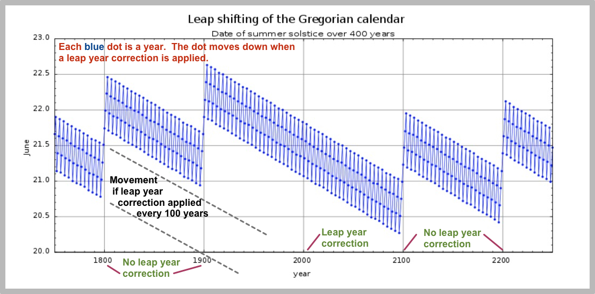

Leap Years
==========

Prior to 1582, the **Julian Calendar** was in wide use and defined _leap years_
as every year divisible by 4. However, it was found in the late 16th
century that the calendar year had drifted from the solar year by approximately
10 days.

The **Gregorian Calendar** was defined in order to thin out the number of
_leap years_ in order to more closely align the calendar year with the solar year.
It was adopted in Papal countries on October 15, 1582, skipping 10 days from the
Julian Calendar date. Protestant countries adopted it after some time.

The following diagram shows visually how both calendars work in practice.

User Story
----------
As a user, I want to know if a year is a _leap year_, so that I can plan
for an extra day on February 29th during those years.

Acceptance Criteria
-------------------
1. All years divisible by `400` **ARE** _leap years_
   (so, for example, `2000` was indeed a _leap year_ as well as `1600`),
2. All years divisible by `100` but not by `400` are **NOT** _leap years_
   (so, for example, `1700`, `1800`, and `1900` were **NOT** _leap years_,
    **NOR** will `2100` be a _leap year_),
3. All years divisible by `4` but not by `100` **ARE** _leap years_
   (e.g., `1976`, `1996`, `2004`),
4. All years not divisible by `4` are **NOT** _leap years_
   (e.g. `2011`, `2013`, `2014`).
5. All years below `1582` divisible by `4` **ARE** _leap years_ 
   (e.g. `1300`, `1400`, `1492`, `1500`, `1580`)
